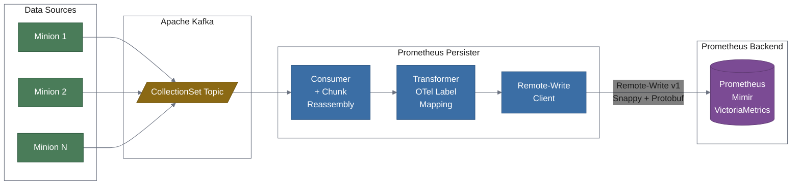
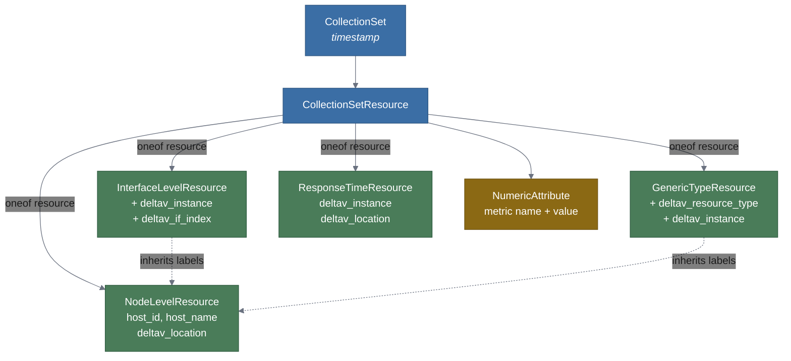
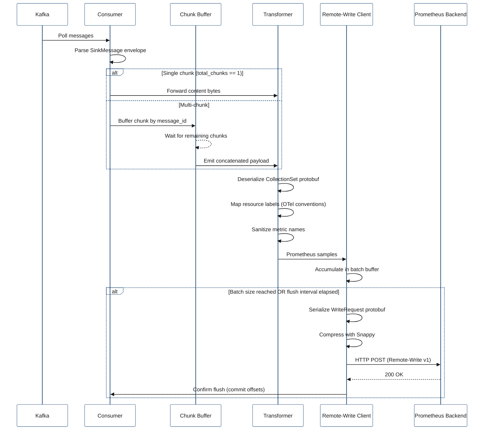
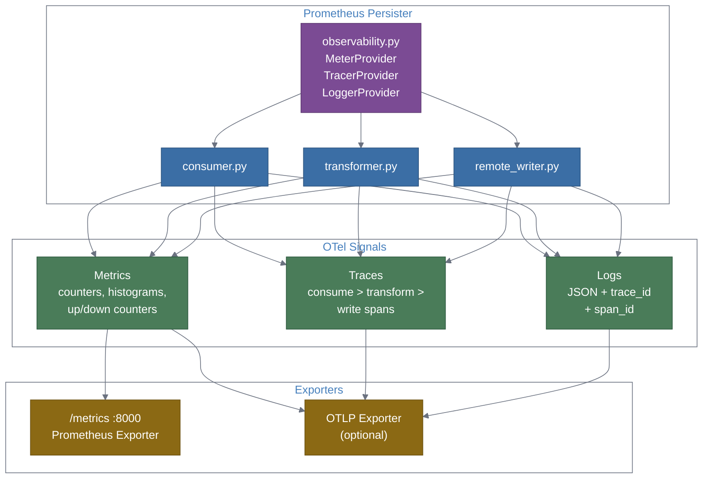
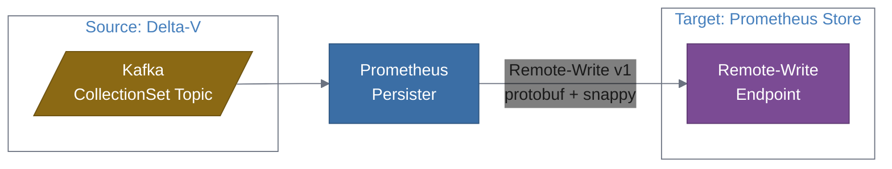

# Prometheus Persister

[](https://github.com/mhuot/prometheus-persister/actions/workflows/ci.yml)
[](https://github.com/mhuot/prometheus-persister/actions/workflows/proto-check.yml)

A standalone Python service that bridges Delta-V performance metrics from Kafka to Prometheus-compatible stores via Remote-Write.

## Overview

Delta-V Minions collect performance metrics (SNMP, WMI, etc.) and publish them as protobuf-encoded `CollectionSet` messages to Kafka. Prometheus Persister consumes these messages, transforms Delta-V hierarchical resource structures into flat Prometheus labels following [OpenTelemetry semantic conventions](https://opentelemetry.io/docs/specs/semconv/), and pushes the metrics via [Prometheus Remote-Write](https://prometheus.io/docs/concepts/remote_write_spec/) to any compatible backend (Prometheus, Mimir, VictoriaMetrics, Thanos).



## Features

- **Kafka consumer** with SinkMessage protobuf envelope parsing and multi-chunk reassembly
- **OTel-conformant label mapping** from Delta-V hierarchical resources to flat Prometheus labels
- **Prometheus Remote-Write v1** with Snappy compression, batching, retry, and backpressure
- **OpenTelemetry instrumentation** for the service itself: metrics, distributed traces, and structured logging
- **Docker-ready** with YAML + environment variable configuration

## Label Mapping

Delta-V resource metadata is mapped to Prometheus labels following OpenTelemetry semantic conventions:

| Delta-V Field | Prometheus Label | OTel Convention |
|:---|:---|:---|
| `node_id` | `host_id` | `host.id` |
| `node_label` | `host_name` | `host.name` |
| `foreign_source` | `deltav_foreign_source` | custom |
| `foreign_id` | `deltav_foreign_id` | custom |
| `location` | `deltav_location` | `deltav.location` |
| `resource_id` | `deltav_resource_id` | `deltav.resource.id` |
| `if_index` | `deltav_if_index` | custom |
| `instance` | `deltav_instance` | custom |
| `resource_type_name` | `deltav_resource_type` | custom |

All four resource types are supported:



## Architecture

### Processing Pipeline



### Observability Stack

The service instruments itself with OpenTelemetry for full observability:



## Integration

The prometheus-persister connects a **source** (Delta-V Kafka) to a **target** (any Prometheus-compatible Remote-Write endpoint).



### Supported Targets

Any Prometheus-compatible Remote-Write endpoint works. Here are the common ones:

| Target | Remote-Write URL | Auth |
|:---|:---|:---|
| **Prometheus** | `http://prometheus:9090/api/v1/write` | None (or reverse proxy) |
| **Grafana Mimir** | `http://mimir:9009/api/v1/push` | Bearer token or basic auth |
| **Grafana Cloud** | `https://prometheus-prod-XX-....grafana.net/api/prom/push` | Basic auth (instance ID + API key) |
| **VictoriaMetrics** | `http://victoriametrics:8428/api/v1/write` | None (or basic auth) |
| **Thanos Receive** | `http://thanos-receive:19291/api/v1/receive` | None (or bearer token) |
| **Cortex** | `http://cortex:9009/api/v1/push` | Bearer token or basic auth |

Configure via `config.yaml` or environment variables:

```bash
# Prometheus (no auth)
REMOTE_WRITE_URL=http://prometheus:9090/api/v1/write

# Grafana Cloud (basic auth)
REMOTE_WRITE_URL=https://prometheus-prod-13-prod-us-east-0.grafana.net/api/prom/push
REMOTE_WRITE_USERNAME=123456
REMOTE_WRITE_PASSWORD=glc_eyJ...

# VictoriaMetrics (no auth)
REMOTE_WRITE_URL=http://victoriametrics:8428/api/v1/write

# Thanos Receive (bearer token)
REMOTE_WRITE_URL=http://thanos-receive:19291/api/v1/receive
REMOTE_WRITE_BEARER_TOKEN=my-token

# Cortex (bearer token)
REMOTE_WRITE_URL=http://cortex:9009/api/v1/push
REMOTE_WRITE_BEARER_TOKEN=my-token
```

### Connecting to Delta-V

The persister consumes from the `OpenNMS.Sink.CollectionSet` Kafka topic. To find your Delta-V Kafka brokers:

1. Check the Delta-V `docker-compose.yml` for the `kafka` service and its advertised listeners
2. Or check a Minion's configuration for `KAFKA_IPC_BOOTSTRAP_SERVERS`

Quick connectivity test:

```bash
# Verify the topic exists and has data
kcat -b your-kafka-broker:9092 -t OpenNMS.Sink.CollectionSet -C -c 1 -e -q | wc -c
```

If this returns a non-zero value, Kafka is reachable and Minions are publishing metrics.

### Guides

- [Grafana Cloud Integration Guide](docs/grafana-cloud-guide.md) — complete walkthrough from setup to dashboards
- [Replacing the Cortex TSS Plugin](docs/replacing-cortex-tss.md) — migrating from the embedded Cortex TSS to the standalone persister

## Configuration

Configuration is loaded from `config.yaml` with environment variable overrides:

```yaml
kafka:
  bootstrap_servers: "localhost:9092"     # or KAFKA_BOOTSTRAP_SERVERS
  consumer_group: "prometheus-persister"  # or KAFKA_CONSUMER_GROUP
  topic: "OpenNMS.Sink.CollectionSet"

remote_write:
  url: "http://localhost:9090/api/v1/write"  # or REMOTE_WRITE_URL
  # username: ""        # Basic auth (or REMOTE_WRITE_USERNAME)
  # password: ""        # Basic auth (or REMOTE_WRITE_PASSWORD)
  # bearer_token: ""    # Bearer auth (or REMOTE_WRITE_BEARER_TOKEN)
  timeout: 30            # seconds
  max_retries: 3

batching:
  max_size: 1000         # samples per batch
  flush_interval: 5      # seconds

chunk_reassembly:
  ttl: 60                # seconds before incomplete chunks are evicted

observability:
  metrics_port: 8000     # Prometheus /metrics endpoint port
  # OTEL_EXPORTER_OTLP_ENDPOINT: set via env var to enable OTLP export
```

## Quick Start

### Prerequisites

- Python 3.11+
- Access to a Kafka cluster with Delta-V topics
- A Prometheus-compatible Remote-Write endpoint

### Run Locally

```bash
# Clone and set up
git clone https://github.com/mhuot/prometheus-persister.git
cd prometheus-persister
python -m venv .venv
source .venv/bin/activate
pip install -e ".[dev]"

# Generate protobuf bindings
make proto

# Configure
cp config.yaml.example config.yaml
# Edit config.yaml with your Kafka and Prometheus endpoints

# Run
python -m prometheus_persister
```

### Run with Docker

```bash
# Build locally
make image

# Or build directly
docker build -t prometheus-persister .

# Run
docker run -e KAFKA_BOOTSTRAP_SERVERS=kafka:9092 \
           -e REMOTE_WRITE_URL=http://mimir:9009/api/v1/push \
           -p 8000:8000 \
           prometheus-persister
```

### Run with Docker Compose

The included `docker-compose.yml` provides a Kafka broker and the persister for local development:

```bash
# Start everything (Kafka + persister)
docker compose up

# Or just the persister (if Kafka is already running)
docker compose up prometheus-persister
```

Set `REMOTE_WRITE_URL` to point at your Prometheus-compatible endpoint:

```bash
REMOTE_WRITE_URL=http://mimir:9009/api/v1/push docker compose up
```

### Adding to the Delta-V Stack

Copy the `prometheus-persister` service block from `docker-compose.yml` into the Delta-V `opennms-container/delta-v/docker-compose.yml`, adjusting `KAFKA_BOOTSTRAP_SERVERS` and `REMOTE_WRITE_URL` for the target environment.

### Pull Pre-built Images

```bash
docker pull ghcr.io/mhuot/prometheus-persister:latest
docker pull ghcr.io/mhuot/prometheus-persister:0.1.0  # specific version
```

## Project Structure

```
prometheus-persister/
├── config.yaml                 # Default configuration
├── pyproject.toml              # Python project metadata and dependencies
├── Dockerfile
├── proto/                      # Source .proto files (from delta-v)
│   ├── sink-message.proto
│   ├── collectionset.proto
│   └── remote_write.proto
├── prometheus_persister/
│   ├── __init__.py
│   ├── main.py                 # Entry point
│   ├── config.py               # YAML + env var config loading
│   ├── consumer.py             # Kafka consumer + chunk reassembly
│   ├── transformer.py          # CollectionSet → Prometheus samples
│   ├── remote_writer.py        # Remote-Write client with batching
│   ├── observability.py        # OTel SDK setup (metrics, traces, logs)
│   └── proto/                  # Generated protobuf bindings
└── tests/
```

## Operational Metrics

The service exposes its own health metrics at `:8000/metrics`:

| Metric | Type | Description |
|:---|:---|:---|
| `prometheus_persister.messages_consumed` | Counter | Kafka messages consumed |
| `prometheus_persister.samples_written` | Counter | Samples sent via Remote-Write |
| `prometheus_persister.write_errors` | Counter | Failed write attempts |
| `prometheus_persister.chunk_reassembly_timeouts` | Counter | Expired incomplete chunks |
| `prometheus_persister.write_latency` | Histogram | Remote-Write request duration (s) |
| `prometheus_persister.transform_duration` | Histogram | CollectionSet transform time (s) |
| `prometheus_persister.batch_size` | Histogram | Samples per flush |
| `prometheus_persister.inflight_chunks` | UpDownCounter | Incomplete chunks in buffer |

Enable OTLP export for traces and logs by setting `OTEL_EXPORTER_OTLP_ENDPOINT`.

## Development

```bash
# Install dev dependencies
pip install -e ".[dev]"

# Run tests
pytest

# Lint and format
black prometheus_persister tests
pylint prometheus_persister
```

## Releasing

Releases are triggered by pushing a git tag:

```bash
git tag v0.1.0
git push --tags
```

The [release workflow](.github/workflows/release.yml) will:
1. Run the full test suite
2. Build multi-arch images (amd64 + arm64) via Docker BuildX
3. Push to GHCR (`ghcr.io/mhuot/prometheus-persister`)
4. Optionally push to Docker Hub (if secrets are configured)

Images are tagged with the version (e.g., `0.1.0`) and `latest`.

### Configuring Secrets

**GHCR (GitHub Container Registry)** works automatically — the built-in `GITHUB_TOKEN` has `packages:write` permission configured in the workflow.

**Docker Hub** (optional) requires two repository secrets:

1. Go to **Settings > Secrets and variables > Actions** in your GitHub repo
2. Add `DOCKERHUB_USERNAME` — your Docker Hub username
3. Add `DOCKERHUB_TOKEN` — a Docker Hub [access token](https://hub.docker.com/settings/security) (not your password)

If these secrets are not set, the release workflow skips Docker Hub and only pushes to GHCR.

## Proto Contract Check

A [weekly workflow](.github/workflows/proto-check.yml) (Monday 6am UTC) validates that the prometheus-persister test suite still passes against the latest Delta-V proto files. This detects breaking schema changes in `sink-message.proto` or `collectionset.proto` before they hit production.

If a break is detected, the workflow automatically opens a GitHub issue with the failing test output and remediation steps.

You can also run it manually from the **Actions** tab > **Proto Contract Check** > **Run workflow**.

### When a Proto Break is Detected

1. Review the opened GitHub issue for the failing test output
2. Fetch the updated protos: check the Delta-V repo for what changed
3. Update `proto/` files and regenerate bindings: `make proto`
4. Fix any broken transformer/consumer code
5. Run tests locally: `pytest`
6. Commit and close the issue

## License

Apache License 2.0
