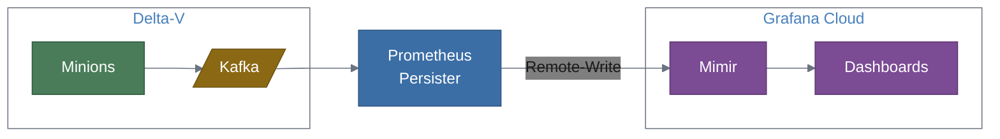

# Grafana Cloud Integration Guide

A step-by-step guide for connecting the Prometheus Persister to an existing Delta-V deployment and Grafana Cloud, going from zero to working dashboards.

## Overview

This guide walks you through:

1. Gathering your Grafana Cloud Mimir credentials
2. Configuring the prometheus-persister to consume from Delta-V's Kafka and write to Grafana Cloud
3. Deploying the persister (Docker or standalone)
4. Verifying metrics flow end-to-end
5. Building dashboards in Grafana Cloud
6. Sending the persister's own OTel telemetry to Grafana Cloud
7. Troubleshooting common issues

## Prerequisites

Before starting, ensure you have:

- **Existing Delta-V deployment** with Minions collecting performance data and publishing to Kafka. The `OpenNMS.Sink.CollectionSet` topic must be active.
- **Grafana Cloud account** with Prometheus (Mimir) enabled. A free tier account works for testing. Sign up at [grafana.com/products/cloud](https://grafana.com/products/cloud/) if needed.
- **Network access** from the host where you'll run the persister to:
  - Delta-V's Kafka brokers (default port 9092)
  - Grafana Cloud's Mimir endpoint (HTTPS, port 443)
- **Docker** (for container deployment) or **Python 3.11+** (for standalone deployment)
