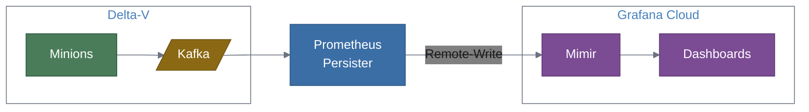

# Grafana Cloud Integration Guide

A step-by-step guide for connecting the Prometheus Persister to an existing Delta-V deployment and Grafana Cloud, going from zero to working dashboards.

## Overview

This guide walks you through:

1. Gathering your Grafana Cloud Mimir credentials
2. Configuring the prometheus-persister to consume from Delta-V's Kafka and write to Grafana Cloud
3. Deploying the persister (Docker or standalone)
4. Verifying metrics flow end-to-end
5. Building dashboards in Grafana Cloud
6. Sending the persister's own OTel telemetry to Grafana Cloud
7. Troubleshooting common issues



## Prerequisites

Before starting, ensure you have:

- **Existing Delta-V deployment** with Minions collecting performance data and publishing to Kafka. The `OpenNMS.Sink.CollectionSet` topic must be active.
- **Grafana Cloud account** with Prometheus (Mimir) enabled. A free tier account works for testing. Sign up at [grafana.com/products/cloud](https://grafana.com/products/cloud/) if needed.
- **Network access** from the host where you'll run the persister to:
  - Delta-V's Kafka brokers (default port 9092)
  - Grafana Cloud's Mimir endpoint (HTTPS, port 443)
- **Docker** (for container deployment) or **Python 3.11+** (for standalone deployment)

## Step 1: Grafana Cloud Setup

You need three values from Grafana Cloud: the **Remote-Write URL**, your **instance ID** (username), and an **API key** (password).

### Find Your Remote-Write Endpoint

1. Log in to [grafana.com](https://grafana.com) and open your Grafana Cloud portal
2. In the left sidebar, click **Infrastructure > Prometheus**
3. Under **Prometheus Details**, locate the **Remote Write Endpoint**. It looks like:
   ```
   https://prometheus-prod-XX-prod-us-east-0.grafana.net/api/prom/push
   ```
4. Copy this URL — this is your `REMOTE_WRITE_URL`
5. On the same page, note the **Username / Instance ID** (a numeric value like `123456`). This is your `REMOTE_WRITE_USERNAME`

### Create an API Key

1. In the Grafana Cloud portal, go to **Security > Access Policies**
2. Click **Create access policy**
3. Name it `prometheus-persister` and grant the **metrics:write** scope
4. Click **Create token** under the new policy
5. Copy the generated token — this is your `REMOTE_WRITE_PASSWORD`

> **Keep this token safe.** It cannot be displayed again after creation. If lost, create a new one.

### Verify Your Credentials

You now have three values. Record them for the next step:

| Value | Environment Variable | Example |
|:---|:---|:---|
| Remote-Write URL | `REMOTE_WRITE_URL` | `https://prometheus-prod-13-prod-us-east-0.grafana.net/api/prom/push` |
| Instance ID | `REMOTE_WRITE_USERNAME` | `123456` |
| API Key | `REMOTE_WRITE_PASSWORD` | `glc_eyJ...` |

## Step 2: Configure the Persister

### Option A: config.yaml

Create a `config.yaml` with your Delta-V Kafka and Grafana Cloud credentials:

```yaml
kafka:
  bootstrap_servers: "your-kafka-broker:9092"  # Delta-V Kafka address
  consumer_group: "prometheus-persister"
  topic: "OpenNMS.Sink.CollectionSet"

remote_write:
  url: "https://prometheus-prod-13-prod-us-east-0.grafana.net/api/prom/push"
  username: "123456"          # Your Grafana Cloud instance ID
  password: "glc_eyJ..."     # Your Grafana Cloud API key
  timeout: 30
  max_retries: 3

batching:
  max_size: 1000
  flush_interval: 5

chunk_reassembly:
  ttl: 60

observability:
  metrics_port: 8000
```

Replace the `kafka.bootstrap_servers`, `remote_write.url`, `remote_write.username`, and `remote_write.password` with your actual values.

### Option B: Environment Variables

If you prefer environment variables (e.g., for Docker), use these instead of a config file:

| Variable | Value |
|:---|:---|
| `KAFKA_BOOTSTRAP_SERVERS` | `your-kafka-broker:9092` |
| `REMOTE_WRITE_URL` | `https://prometheus-prod-13-prod-us-east-0.grafana.net/api/prom/push` |
| `REMOTE_WRITE_USERNAME` | `123456` |
| `REMOTE_WRITE_PASSWORD` | `glc_eyJ...` |

Environment variables override `config.yaml` values, so you can use a base config file and override secrets via env vars in production.

## Step 3: Deploy

### Option A: Docker Compose (alongside Delta-V)

Add the persister to your existing Delta-V `docker-compose.yml`:

```yaml
  prometheus-persister:
    image: ghcr.io/mhuot/prometheus-persister:latest
    container_name: delta-v-prometheus-persister
    depends_on:
      kafka:
        condition: service_healthy
    environment:
      KAFKA_BOOTSTRAP_SERVERS: kafka:9092
      REMOTE_WRITE_URL: "https://prometheus-prod-13-prod-us-east-0.grafana.net/api/prom/push"
      REMOTE_WRITE_USERNAME: "123456"
      REMOTE_WRITE_PASSWORD: "glc_eyJ..."
    ports:
      - "8000:8000"
    healthcheck:
      test: ["CMD-SHELL", "curl -sf http://localhost:8000/metrics || exit 1"]
      interval: 15s
      timeout: 5s
      retries: 3
      start_period: 30s
```

Then start it:

```bash
docker compose up -d prometheus-persister
```

### Option B: Standalone Docker Run

If you're not using Docker Compose:

```bash
docker run -d \
  --name prometheus-persister \
  -e KAFKA_BOOTSTRAP_SERVERS=your-kafka-broker:9092 \
  -e REMOTE_WRITE_URL="https://prometheus-prod-13-prod-us-east-0.grafana.net/api/prom/push" \
  -e REMOTE_WRITE_USERNAME="123456" \
  -e REMOTE_WRITE_PASSWORD="glc_eyJ..." \
  -p 8000:8000 \
  ghcr.io/mhuot/prometheus-persister:latest
```

> **Network note:** The container must be able to reach both the Kafka broker and `grafana.net` on port 443. If Kafka is on a Docker network, use `--network <delta-v-network>`.

### Option C: Standalone Python

For running directly on a host with Kafka access:

```bash
# Clone and install
git clone https://github.com/mhuot/prometheus-persister.git
cd prometheus-persister
python -m venv .venv
source .venv/bin/activate
pip install -e .

# Generate protobuf bindings
pip install grpcio-tools
make proto

# Create your config (edit with your values from Steps 1-2)
cp config.yaml config.local.yaml
# Edit config.local.yaml with your Kafka and Grafana Cloud settings

# Run
python -m prometheus_persister config.local.yaml
```

## Step 4: Verify Metrics Flow

Verify each stage incrementally to isolate issues.

### 4a. Check the persister is running

```bash
curl -s http://localhost:8000/metrics | grep prometheus_persister
```

You should see counters like:

```
prometheus_persister_messages_consumed_total 42
prometheus_persister_samples_written_total 168
```

If `messages_consumed` is `0`, the persister isn't receiving messages from Kafka. See [Troubleshooting](#troubleshooting).

If `messages_consumed` is increasing but `samples_written` is `0`, check for `write_errors`:

```bash
curl -s http://localhost:8000/metrics | grep write_errors
```

### 4b. Check Kafka connectivity

Verify the CollectionSet topic has messages:

```bash
# From a host with kafka-console-consumer or kcat installed
kcat -b your-kafka-broker:9092 -t OpenNMS.Sink.CollectionSet -C -c 1 -e -q | wc -c
```

If this returns `0`, Minions are not publishing to Kafka.

### 4c. Verify metrics in Grafana Cloud

1. Open your Grafana Cloud instance (e.g., `https://your-org.grafana.net`)
2. Go to **Explore** (compass icon in the left sidebar)
3. Select your **Prometheus** data source
4. Run this PromQL query:
   ```
   {host_id!=""}
   ```
5. You should see time-series with Delta-V labels:

   ```
   mib2_interfaces_ifInOctets{host_id="42", host_name="router1", deltav_location="Default", deltav_instance="eth0"}
   ```

If no results appear, wait 1-2 minutes for the first batch to flush, then retry. If still empty, check the persister logs for Remote-Write errors.

## Step 5: Build Dashboards

### Example PromQL Queries

Use these in Grafana Cloud dashboards (via **Dashboards > New dashboard > Add visualization**):

**Interface traffic by host (bytes/sec):**
```promql
rate(mib2_interfaces_ifInOctets_total{host_name=~".+"}[5m])
```

**Top 10 hosts by inbound traffic:**
```promql
topk(10, rate(mib2_interfaces_ifInOctets_total[5m]))
```

**CPU load by node:**
```promql
net_snmp_hrSystemProcesses{host_name=~".+"}
```

**All metrics for a specific host:**
```promql
{host_name="router1"}
```

**Response time by target:**
```promql
icmp_response_time{deltav_instance=~".+"}
```

### Label Filters

All Delta-V metrics include these labels for filtering and grouping:

| Label | Description | Example |
|:---|:---|:---|
| `host_id` | Node ID | `42` |
| `host_name` | Node label | `router1` |
| `deltav_location` | Monitoring location | `Default` |
| `deltav_instance` | Interface or resource instance | `eth0` |
| `deltav_resource_type` | Resource type | `interfaceSnmp` |
| `deltav_resource_id` | Full resource path | `node[42].interfaceSnmp[eth0]` |

### Quick Dashboard Setup

1. Go to **Dashboards > New dashboard**
2. Click **Add visualization**
3. Select your **Prometheus** data source
4. Paste one of the PromQL queries above
5. Set the **Legend** to `{{host_name}} - {{deltav_instance}}` for readable labels
6. Repeat for additional panels

> **Tip:** Use the `host_name` label in dashboard variables to create a host selector dropdown: **Dashboard settings > Variables > New variable** with query `label_values(host_name)`.

## Step 6: Monitor the Persister with OTel

The persister instruments itself with OpenTelemetry. You can send its own metrics, traces, and logs to Grafana Cloud for full-stack observability.

### Get Your Grafana Cloud OTLP Endpoint

1. In the Grafana Cloud portal, go to **Infrastructure > OpenTelemetry**
2. Note the **OTLP endpoint** (e.g., `https://otlp-gateway-prod-us-east-0.grafana.net/otlp`)
3. You'll use the same instance ID and API key from [Step 1](#step-1-grafana-cloud-setup)

### Configure OTLP Export

Add these environment variables to your deployment:

```bash
OTEL_EXPORTER_OTLP_ENDPOINT=https://otlp-gateway-prod-us-east-0.grafana.net/otlp
OTEL_EXPORTER_OTLP_HEADERS="Authorization=Basic $(echo -n '123456:glc_eyJ...' | base64)"
```

For Docker Compose, add to your `environment:` block:

```yaml
    environment:
      # ... existing Kafka and Remote-Write vars ...
      OTEL_EXPORTER_OTLP_ENDPOINT: "https://otlp-gateway-prod-us-east-0.grafana.net/otlp"
      OTEL_EXPORTER_OTLP_HEADERS: "Authorization=Basic <base64-encoded instance_id:api_key>"
```

Generate the base64 value:

```bash
echo -n '123456:glc_eyJ...' | base64
```

### What You Get

With OTLP export enabled, Grafana Cloud receives:

- **Metrics**: `prometheus_persister.messages_consumed`, `samples_written`, `write_errors`, `write_latency`, etc. — visible in Grafana Explore with the Prometheus data source.
- **Traces**: Spans for `consume_message` → `transform_collectionset` → `remote_write_batch` — visible in Grafana Explore with the Tempo data source. Useful for debugging latency in the pipeline.
- **Logs**: JSON-structured logs with `trace_id` and `span_id` for correlation — visible in Grafana Explore with the Loki data source.

> **Note:** The `/metrics` Prometheus endpoint on port 8000 continues to work regardless of OTLP export. Both can run simultaneously.
