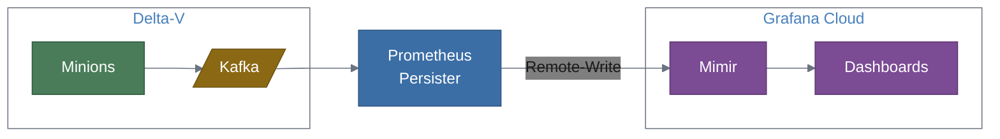

# Grafana Cloud Integration Guide

A step-by-step guide for connecting the Prometheus Persister to an existing Delta-V deployment and Grafana Cloud, going from zero to working dashboards.

## Overview

This guide walks you through:

1. Gathering your Grafana Cloud Mimir credentials
2. Configuring the prometheus-persister to consume from Delta-V's Kafka and write to Grafana Cloud
3. Deploying the persister (Docker or standalone)
4. Verifying metrics flow end-to-end
5. Building dashboards in Grafana Cloud
6. Sending the persister's own OTel telemetry to Grafana Cloud
7. Troubleshooting common issues



## Prerequisites

Before starting, ensure you have:

- **Existing Delta-V deployment** with Minions collecting performance data and publishing to Kafka. The `OpenNMS.Sink.CollectionSet` topic must be active.
- **Grafana Cloud account** with Prometheus (Mimir) enabled. A free tier account works for testing. Sign up at [grafana.com/products/cloud](https://grafana.com/products/cloud/) if needed.
- **Network access** from the host where you'll run the persister to:
  - Delta-V's Kafka brokers (default port 9092)
  - Grafana Cloud's Mimir endpoint (HTTPS, port 443)
- **Docker** (for container deployment) or **Python 3.11+** (for standalone deployment)

## Step 1: Grafana Cloud Setup

You need three values from Grafana Cloud: the **Remote-Write URL**, your **instance ID** (username), and an **API key** (password).

### Find Your Remote-Write Endpoint

1. Log in to [grafana.com](https://grafana.com) and open your Grafana Cloud portal
2. In the left sidebar, click **Infrastructure > Prometheus**
3. Under **Prometheus Details**, locate the **Remote Write Endpoint**. It looks like:
   ```
   https://prometheus-prod-XX-prod-us-east-0.grafana.net/api/prom/push
   ```
4. Copy this URL — this is your `REMOTE_WRITE_URL`
5. On the same page, note the **Username / Instance ID** (a numeric value like `123456`). This is your `REMOTE_WRITE_USERNAME`

### Create an API Key

1. In the Grafana Cloud portal, go to **Security > Access Policies**
2. Click **Create access policy**
3. Name it `prometheus-persister` and grant the **metrics:write** scope
4. Click **Create token** under the new policy
5. Copy the generated token — this is your `REMOTE_WRITE_PASSWORD`

> **Keep this token safe.** It cannot be displayed again after creation. If lost, create a new one.

### Verify Your Credentials

You now have three values. Record them for the next step:

| Value | Environment Variable | Example |
|:---|:---|:---|
| Remote-Write URL | `REMOTE_WRITE_URL` | `https://prometheus-prod-13-prod-us-east-0.grafana.net/api/prom/push` |
| Instance ID | `REMOTE_WRITE_USERNAME` | `123456` |
| API Key | `REMOTE_WRITE_PASSWORD` | `glc_eyJ...` |

## Step 2: Configure the Persister

### Option A: config.yaml

Create a `config.yaml` with your Delta-V Kafka and Grafana Cloud credentials:

```yaml
kafka:
  bootstrap_servers: "your-kafka-broker:9092"  # Delta-V Kafka address
  consumer_group: "prometheus-persister"
  topic: "OpenNMS.Sink.CollectionSet"

remote_write:
  url: "https://prometheus-prod-13-prod-us-east-0.grafana.net/api/prom/push"
  username: "123456"          # Your Grafana Cloud instance ID
  password: "glc_eyJ..."     # Your Grafana Cloud API key
  timeout: 30
  max_retries: 3

batching:
  max_size: 1000
  flush_interval: 5

chunk_reassembly:
  ttl: 60

observability:
  metrics_port: 8000
```

Replace the `kafka.bootstrap_servers`, `remote_write.url`, `remote_write.username`, and `remote_write.password` with your actual values.

### Option B: Environment Variables

If you prefer environment variables (e.g., for Docker), use these instead of a config file:

| Variable | Value |
|:---|:---|
| `KAFKA_BOOTSTRAP_SERVERS` | `your-kafka-broker:9092` |
| `REMOTE_WRITE_URL` | `https://prometheus-prod-13-prod-us-east-0.grafana.net/api/prom/push` |
| `REMOTE_WRITE_USERNAME` | `123456` |
| `REMOTE_WRITE_PASSWORD` | `glc_eyJ...` |

Environment variables override `config.yaml` values, so you can use a base config file and override secrets via env vars in production.
