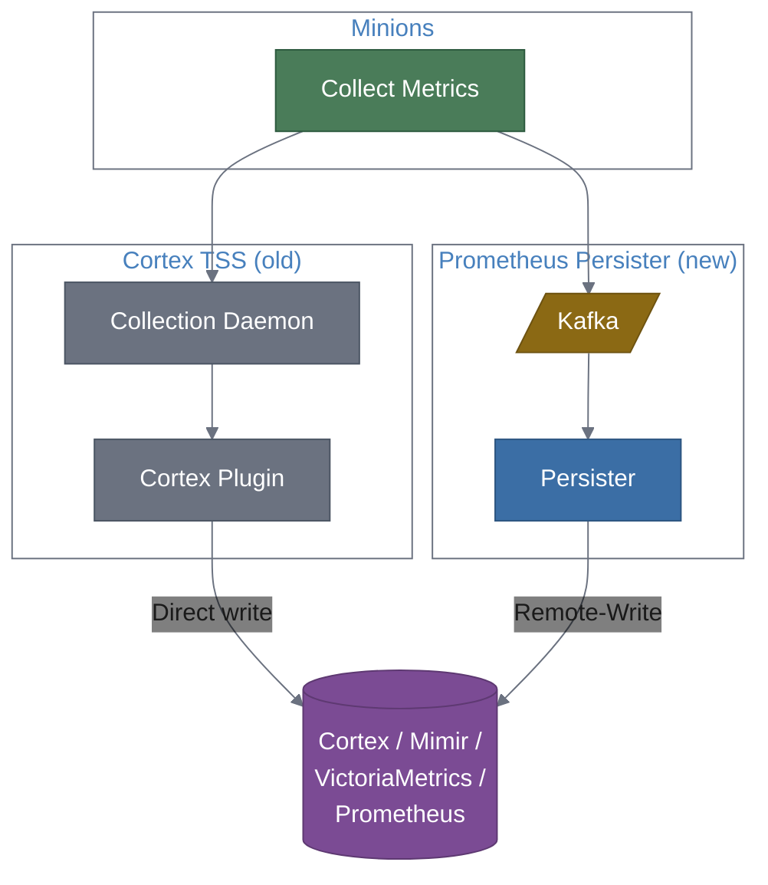

# Replacing the Cortex TSS Plugin

This guide explains how the Prometheus Persister can replace the embedded Cortex TSS (Time Series Strategy) plugin in Delta-V and OpenNMS, and walks through the migration.

## Background

The Cortex TSS plugin is a Java plugin that runs inside the OpenNMS/Delta-V collection daemon. It intercepts `CollectionSet` metrics and writes them directly to a Cortex instance. While functional, it has limitations:

- **Tightly coupled** — requires a Java plugin installed inside the daemon, version-matched to OpenNMS
- **Cortex-only** — cannot write to Mimir, VictoriaMetrics, Thanos, or other Prometheus-compatible stores
- **Scales with the daemon** — cannot be scaled independently
- **OpenNMS-native labels** — does not follow OpenTelemetry semantic conventions

## How the Persister Replaces It

The Prometheus Persister taps the same metric data from a different point — Kafka instead of the internal daemon pipeline:



Both paths produce the same metrics from the same Minion data. The persister path goes through Kafka, which Delta-V already uses for inter-service communication.

## Comparison

| | Cortex TSS Plugin | Prometheus Persister |
|:---|:---|:---|
| **Architecture** | Embedded Java plugin | Standalone Python service |
| **Data source** | Internal daemon pipeline | Kafka Sink IPC |
| **Target backends** | Cortex only | Any Remote-Write (Cortex, Mimir, VictoriaMetrics, Prometheus, Thanos, Grafana Cloud) |
| **Scaling** | Tied to daemon instance | Independent, horizontal via Kafka consumer groups |
| **Deployment** | Plugin JAR inside OpenNMS | Docker container or standalone Python |
| **Label conventions** | OpenNMS-native | OTel-conformant (`host.id`, `host.name`, etc.) |
| **Observability** | Limited | Full OTel instrumentation (metrics, traces, logs) |
| **Latency** | Lower (direct write) | Slightly higher (Kafka hop, typically <1s) |
| **Kafka required** | No | Yes (but Delta-V already has it) |

## Prerequisites

- **Delta-V deployment with Kafka** — the Sink IPC must be publishing `CollectionSet` messages to the `OpenNMS.Sink.CollectionSet` topic. This is the default in Delta-V.
- **Legacy OpenNMS** — Kafka Sink IPC must be explicitly enabled. If your deployment doesn't use Kafka, the persister won't work as a replacement.

## Migration Steps

### Step 1: Verify Kafka is publishing metrics

Confirm the CollectionSet topic has data:

```bash
kcat -b your-kafka-broker:9092 -t OpenNMS.Sink.CollectionSet -C -c 1 -e -q | wc -c
```

A non-zero result means Minions are publishing to Kafka and the persister can consume the data.

### Step 2: Deploy the persister pointing to your existing Cortex

Configure the persister to write to the same Cortex instance the TSS plugin uses:

```bash
docker run -d \
  --name prometheus-persister \
  -e KAFKA_BOOTSTRAP_SERVERS=your-kafka-broker:9092 \
  -e REMOTE_WRITE_URL=http://your-cortex:9009/api/v1/push \
  -e REMOTE_WRITE_BEARER_TOKEN=your-cortex-token \
  -p 8000:8000 \
  ghcr.io/mhuot/prometheus-persister:latest
```

### Step 3: Run both in parallel

Keep the Cortex TSS plugin running alongside the persister. This lets you:

- Verify the persister is producing the same metrics
- Compare label formats (OTel vs legacy)
- Ensure no data gaps

Check the persister is working:

```bash
curl -s http://localhost:8000/metrics | grep samples_written
```

Query Cortex to confirm metrics from both sources:

```promql
# Persister metrics (OTel labels)
{host_id!=""}

# TSS plugin metrics (legacy labels)  
{node_id!=""}
```

### Step 4: Update dashboards for OTel labels

The persister uses different label names than the Cortex TSS plugin:

| Cortex TSS (old) | Persister (new) |
|:---|:---|
| `node_id` | `host_id` |
| `node_label` | `host_name` |
| `location` | `deltav_location` |
| `resource_id` | `deltav_resource_id` |
| `instance` | `deltav_instance` |

Update your Grafana dashboards and alert rules to use the new label names. You can use PromQL label matching to query both during the transition:

```promql
# Matches both old and new labels
rate({__name__=~"mib2.*", host_id!=""} [5m])
or
rate({__name__=~"mib2.*", node_id!=""} [5m])
```

### Step 5: Disable the Cortex TSS plugin

Once you've verified the persister is producing correct metrics and dashboards are updated:

1. Remove the Cortex TSS plugin configuration from your Delta-V deployment
2. Remove the Cortex TSS plugin JAR if installed manually
3. Restart the affected daemons

The persister is now your sole metric persistence path.

### Step 6: (Optional) Switch to a different backend

Now that you're using the persister, you're no longer locked into Cortex. You can switch to any Remote-Write target by changing `REMOTE_WRITE_URL`:

```bash
# Switch to Grafana Mimir
REMOTE_WRITE_URL=http://mimir:9009/api/v1/push

# Switch to Grafana Cloud
REMOTE_WRITE_URL=https://prometheus-prod-XX-....grafana.net/api/prom/push

# Switch to VictoriaMetrics
REMOTE_WRITE_URL=http://victoriametrics:8428/api/v1/write
```

No code changes, no plugin swaps — just a config change and restart.

## Rollback

If you need to revert, re-enable the Cortex TSS plugin and stop the persister. The Kafka topic continues to receive data regardless, so no metrics are lost during the switch.
