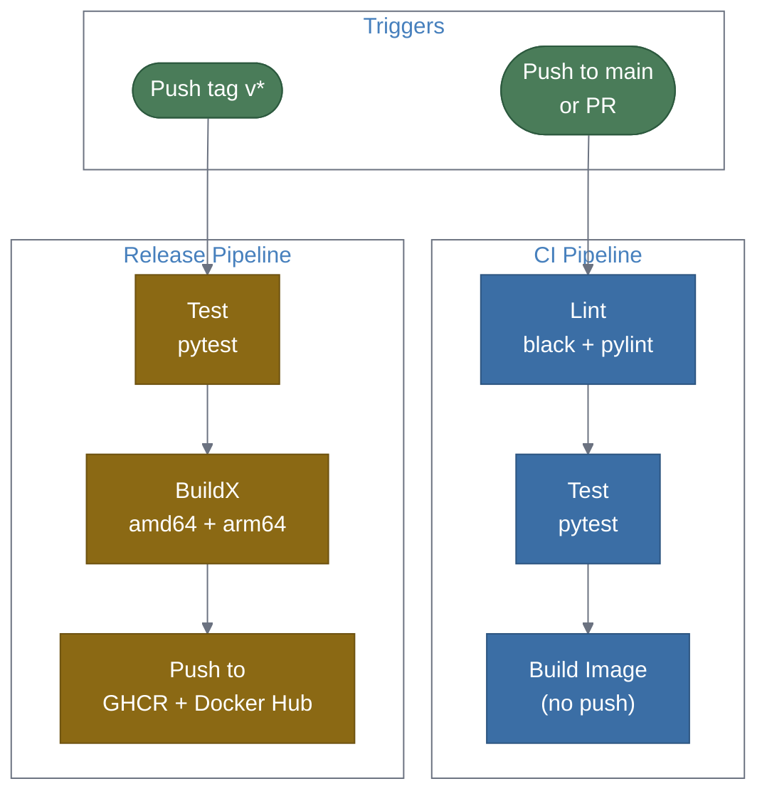

## Why

The prometheus-persister has a basic Dockerfile but no CI/CD pipeline and the image doesn't follow Delta-V container conventions. To be a first-class citizen in the Delta-V ecosystem, the image needs OCI labels, non-root execution, health checks, and a proper entrypoint. The project also needs GitHub Actions workflows for testing, building, and publishing images so that every push is validated and releases produce distributable container images.

## What Changes

- **Dockerfile overhaul**: Align with Delta-V conventions — OCI labels via build args, non-root user (UID 10001), `STOPSIGNAL SIGTERM`, health check endpoint, entrypoint wrapper script, `.dockerignore`.
- **GitHub Actions CI workflow**: Lint (black, pylint), test (pytest), and build Docker image on every push and PR.
- **GitHub Actions release workflow**: On git tag push (`v*`), build and push multi-arch images to Docker Hub / GHCR with version + latest tags.
- **Docker Compose integration**: Add prometheus-persister service definition compatible with the Delta-V `docker-compose.yml` pattern.
- **Makefile targets**: Add `image`, `push`, and `clean` targets following Delta-V `common.mk` patterns.

## Capabilities

### New Capabilities
- `ci-pipeline`: GitHub Actions workflow for linting, testing, and building the Docker image on push/PR.
- `release-pipeline`: GitHub Actions workflow for building and publishing multi-arch container images on tagged releases.
- `container-conventions`: Dockerfile aligned with Delta-V practices — OCI labels, non-root user, health check, STOPSIGNAL, entrypoint script.
- `proto-contract-check`: Weekly scheduled workflow that validates tests against latest Delta-V proto files and opens an issue on breaking changes.

### Modified Capabilities
_(none)_

## High-Level Flow

## Impact

- **New files**: `.github/workflows/ci.yml`, `.github/workflows/release.yml`, `.dockerignore`, `entrypoint.sh`, `docker-compose.yml`.
- **Modified files**: `Dockerfile`, `Makefile`.
- **Secrets required**: `DOCKERHUB_USERNAME` and `DOCKERHUB_TOKEN` (or GHCR token) for image publishing.
- **Infrastructure**: Docker Hub org or GHCR namespace for image hosting.
