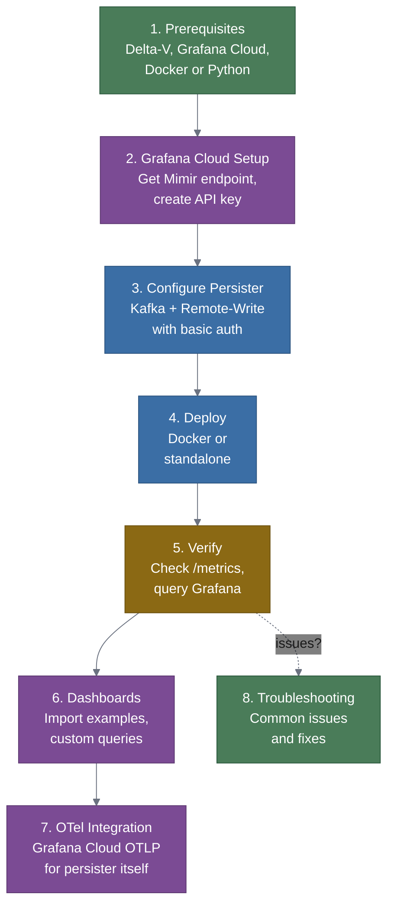
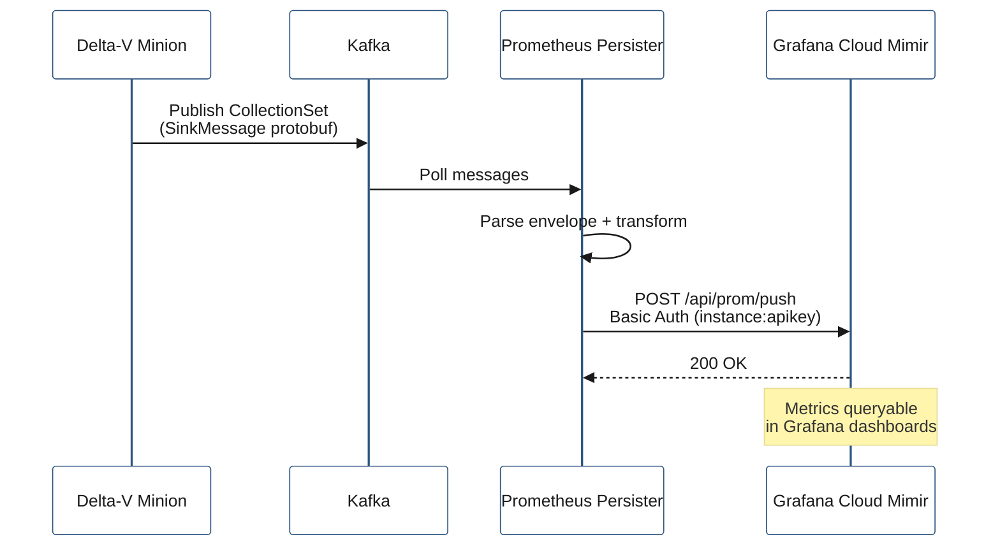

## Context

The prometheus-persister bridges Delta-V Kafka metrics to Prometheus-compatible stores via Remote-Write. Grafana Cloud provides a managed Mimir instance with a Remote-Write endpoint that accepts basic auth. Users need a guide that connects these pieces: an existing Delta-V deployment (with Minions publishing to Kafka), the prometheus-persister, and Grafana Cloud's Mimir + Grafana dashboards.

## Goals / Non-Goals

**Goals:**
- Complete step-by-step Grafana Cloud guide from zero to working dashboards.
- Cover both Docker and standalone deployment options.
- Include verification steps at each stage so users can debug incrementally.
- Provide example Grafana dashboards using the Delta-V label conventions (`host_id`, `host_name`, `deltav_*`).
- Cover OTel observability integration for monitoring the persister itself.
- Include a troubleshooting section for common failure modes.
- Add a generalized "Integration" section to README.md explaining source/target architecture with config examples for Prometheus, Mimir, VictoriaMetrics, and Thanos.

**Non-Goals:**
- Setting up Delta-V from scratch (assumes existing deployment).
- Grafana Cloud account creation (link to their docs).
- Production hardening (HA, autoscaling) — mentioned as next steps only.

## Guide Structure

## Decisions

### 1. Guide scope: Grafana Cloud specific, not generic Prometheus
- **Decision**: Write the guide specifically for Grafana Cloud, not a generic "any Remote-Write endpoint" guide.
- **Rationale**: Grafana Cloud has specific auth patterns (basic auth with instance ID + API key), specific endpoint URLs, and specific dashboard import flows. A generic guide would be too vague to be useful. Users with self-hosted Prometheus/Mimir can adapt the Remote-Write URL and auth sections.

### 2. Two deployment paths: Docker and standalone
- **Decision**: Cover both Docker Compose (add persister to Delta-V stack) and standalone Python (venv on a host with Kafka access).
- **Rationale**: Docker is the primary Delta-V deployment model, but some users run components directly for debugging or in environments without Docker.

### 3. Verification at each stage
- **Decision**: Include explicit verification steps after each configuration step (Kafka connectivity, Remote-Write auth, metric presence in Grafana).
- **Rationale**: E2E guides that skip verification leave users debugging the entire pipeline at once. Incremental verification isolates issues.

### 4. Example dashboard JSON
- **Decision**: Include a ready-to-import Grafana dashboard JSON that uses the Delta-V label conventions and common metrics.
- **Rationale**: A working dashboard provides immediate value and demonstrates how to query the persisted metrics. Users can customize from there.

### 5. Generalized Integration section in README
- **Decision**: Add an "Integration" section to the README with a source/target Mermaid diagram, a "Supported Targets" table showing URL format and auth for Prometheus, Mimir, VictoriaMetrics, and Thanos, and a "Connecting to Delta-V" subsection explaining how to locate and verify Kafka connectivity.
- **Rationale**: The README should give users a quick understanding of how the persister fits between any Delta-V source and any Prometheus-compatible target. Target-specific deep dives (like Grafana Cloud) go in `docs/`. The README is the landing page — it should answer "what can I connect this to?" immediately.

### 6. OTel integration section
- **Decision**: Include a section on sending the persister's own OTel telemetry to Grafana Cloud's OTLP endpoint for full-stack observability.
- **Rationale**: Grafana Cloud supports OTLP ingestion. Users get metrics, traces, and logs for the persister itself alongside the Delta-V metrics it forwards.

## Data Flow Detail

## Deployment

This is a documentation-only change. No deployment steps required — the guide itself documents deployment.

## Risks / Trade-offs

- **[Risk] Grafana Cloud UI changes** → Cloud UI evolves; screenshots or specific menu paths may go stale. Mitigation: Use text descriptions with menu paths rather than screenshots. Link to Grafana Cloud docs for account setup.
- **[Risk] Endpoint URL format changes** → Grafana Cloud Mimir endpoint format may change. Mitigation: Reference their official docs for the current endpoint pattern, include a note about where to find it.
