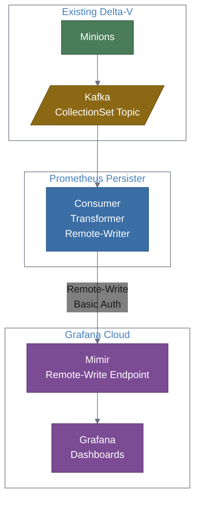

## Why

Users deploying the prometheus-persister alongside an existing Delta-V installation need a clear, end-to-end guide for connecting it to Grafana Cloud. This involves configuring the Grafana Cloud Mimir Remote-Write endpoint, connecting to Delta-V's Kafka, verifying metric flow, and building dashboards. Without a guide, users must piece together docs from three different systems (Delta-V, prometheus-persister, Grafana Cloud).

## What Changes

- **New guide document**: `docs/grafana-cloud-guide.md` — a thorough step-by-step walkthrough covering prerequisites, Grafana Cloud setup, prometheus-persister configuration, deployment options (Docker, standalone), verification, dashboards, OTel observability integration, and troubleshooting.
- **README integration section**: Add a generalized "Integration" section to the README explaining how to connect any Delta-V source (Kafka) to any Prometheus-compatible target (Prometheus, Mimir, VictoriaMetrics, Thanos) with configuration examples for each.

## High-Level Flow

## Capabilities

### New Capabilities
- `grafana-cloud-guide`: Step-by-step deployment guide covering Grafana Cloud setup, prometheus-persister configuration, verification, dashboards, and troubleshooting.

### Modified Capabilities
_(none)_

## Impact

- **New files**: `docs/grafana-cloud-guide.md`
- **Modified files**: `README.md` (integration section + link to guide)
- **No code changes** — documentation only.
