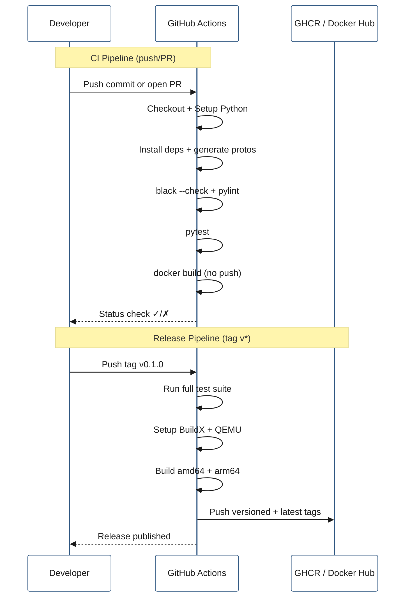
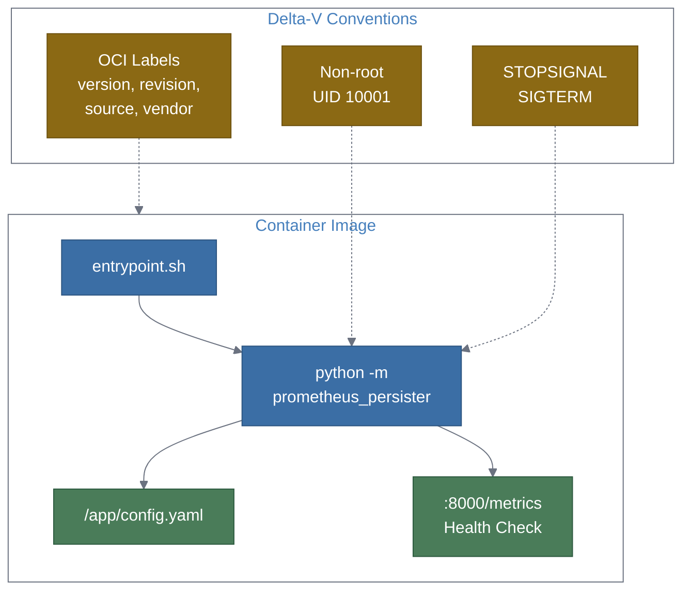

## Context

The prometheus-persister is a standalone Python service in the Delta-V ecosystem. Its current Dockerfile is functional but doesn't follow Delta-V container conventions. There is no CI/CD pipeline — no automated testing, linting, image building, or publishing. Delta-V uses GitHub Actions for CI, Docker BuildX for multi-platform images, OCI labels for image metadata, non-root execution, and Docker Hub for distribution.

### Current Dockerfile gaps vs Delta-V conventions

| Convention | Delta-V | Current | Gap |
|:---|:---|:---|:---|
| OCI labels | Full set via build args | None | Missing |
| Non-root user | UID 10001 | Runs as root | Missing |
| STOPSIGNAL | SIGTERM | Not set | Missing |
| Health check | curl to actuator/REST | None | Missing |
| Entrypoint | Wrapper script | Direct python | Missing |
| .dockerignore | Present | None | Missing |
| BuildX | Multi-platform | Single platform | Missing |

## Goals / Non-Goals

**Goals:**
- Dockerfile fully aligned with Delta-V container conventions.
- CI workflow: lint + test + build on every push/PR.
- Release workflow: build + tag + push multi-arch images on git tags.
- Docker Compose service definition compatible with Delta-V stack.
- Makefile targets for local image build/push.

**Non-Goals:**
- Helm charts or Kubernetes manifests (future enhancement).
- Automated dependency updates (e.g., Dependabot — separate concern).
- Integration testing against live Kafka/Prometheus in CI (unit tests only).

## Decisions

### 1. Dockerfile: Delta-V convention alignment
- **Decision**: Restructure the Dockerfile with OCI labels, non-root user (UID 10001), `STOPSIGNAL SIGTERM`, entrypoint wrapper, and a `/health` endpoint.
- **Rationale**: Delta-V images consistently use these patterns. Alignment ensures the prometheus-persister fits naturally into existing orchestration and monitoring.
- **OCI Labels**: Pass via `--build-arg` at build time: `BUILD_DATE`, `VERSION`, `SOURCE`, `REVISION`, `BUILD_BRANCH`. Matches the `org.opencontainers.image.*` and `org.opennms.cicd.*` labels used in Delta-V.
- **User**: Create `persister` user with UID 10001 / GID 10001, matching Delta-V's non-root pattern.
- **Entrypoint**: `entrypoint.sh` wrapper that handles environment setup before exec'ing the Python process. Allows config file path override and pre-start hooks.

### 2. Health check endpoint
- **Decision**: The existing OTel Prometheus `/metrics` endpoint on port 8000 doubles as the health check target. The Dockerfile `HEALTHCHECK` and Docker Compose health check will curl this endpoint.
- **Rationale**: No need for a separate health endpoint — if `/metrics` responds, the service is alive and the OTel stack is initialized. This is simpler than adding a dedicated `/health` route.
- **Alternatives**: Add a `/health` Flask endpoint (adds a dependency), use the Kafka consumer lag as health signal (too complex for a container health check).

### 3. CI workflow: GitHub Actions
- **Decision**: Single `ci.yml` workflow triggered on push to `main` and on PRs. Steps: checkout → setup Python 3.11 → install deps → generate protos → black check → pylint → pytest → docker build (no push).
- **Rationale**: Mirrors Delta-V's CI approach (single workflow, build validation). Building the Docker image in CI validates the Dockerfile without publishing.
- **Caching**: Use `actions/setup-python` with pip caching and Docker layer caching via `docker/build-push-action`.

### 4. Release workflow: tag-triggered image publishing
- **Decision**: `release.yml` triggered on tags matching `v*`. Builds multi-arch images (linux/amd64, linux/arm64) via Docker BuildX and pushes to both GHCR (`ghcr.io/mhuot/prometheus-persister`) and optionally Docker Hub.
- **Tagging strategy**:
  - `<registry>/<org>/prometheus-persister:<version>` (from tag, e.g., `v0.1.0` → `0.1.0`)
  - `<registry>/<org>/prometheus-persister:latest`
- **Rationale**: Tag-triggered releases match Delta-V's `delta-v-release.yml` pattern. GHCR is free for public repos; Docker Hub optional via secrets.
- **Alternatives**: Only GHCR (simpler but less accessible), only Docker Hub (requires paid org for private).

### 5. Docker Compose service definition
- **Decision**: Provide a `docker-compose.yml` that defines the prometheus-persister service with Delta-V-compatible patterns: depends_on kafka, environment variables, health check, port mapping.
- **Rationale**: Users can `docker compose up` for local development or drop the service definition into the Delta-V compose stack.

### 6. Makefile targets
- **Decision**: Add `image`, `push`, and `clean` targets to the existing Makefile, following Delta-V's `common.mk` pattern with `docker buildx build`.
- **Rationale**: Consistent with how Delta-V developers build images locally.

## Architecture

### CI/CD Pipeline Flow



### Container Architecture (Delta-V Aligned)



## Deployment

### Local Development
```bash
# Build image locally
make image

# Run with Docker Compose (includes Kafka)
docker compose up

# Push to registry (requires auth)
make push
```

### Release Process
1. Tag the release: `git tag v0.1.0 && git push --tags`
2. GitHub Actions triggers the release workflow automatically
3. Multi-arch images are built and pushed to GHCR (and Docker Hub if configured)
4. Pull the published image: `docker pull ghcr.io/mhuot/prometheus-persister:0.1.0`

### Adding to Delta-V Stack
Copy the `prometheus-persister` service block from `docker-compose.yml` into the Delta-V `opennms-container/delta-v/docker-compose.yml`, adjusting the `KAFKA_BOOTSTRAP_SERVERS` and `REMOTE_WRITE_URL` for the target environment.

## Risks / Trade-offs

- **[Risk] Multi-arch build time** → ARM64 cross-compilation can be slow in CI. Mitigation: Use QEMU emulation via `docker/setup-qemu-action`; accept ~5 min overhead.
- **[Risk] GHCR token permissions** → GHCR requires `packages: write` permission. Mitigation: Set in workflow permissions block.
- **[Risk] Health check false positives** → `/metrics` may respond before the Kafka consumer is fully connected. Mitigation: Set `start_period: 30s` in the health check to allow startup time.
